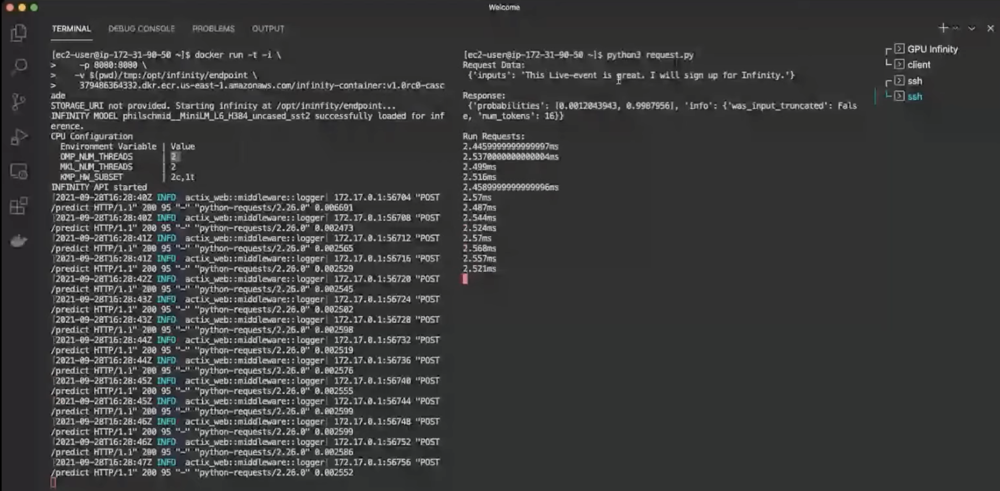
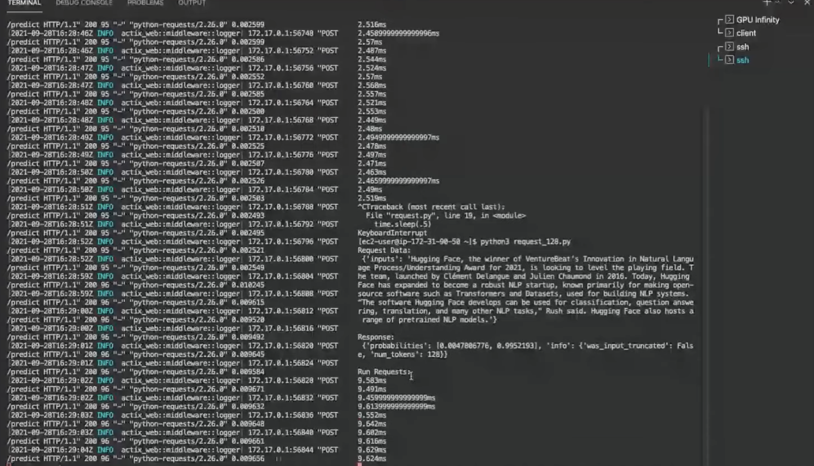
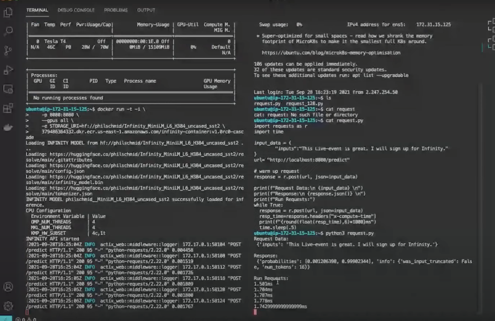
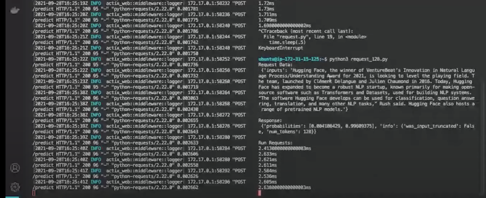

### Quick Summary - Use vendor supplied Pytorch and you will get the same performance as Infinity (as of 10/3/2021)
tl;dr: Repackage OneDNN/DNNL on CPU and CUDNN for TensorRT/Tensorcore and you have Infinity without $20k/cpu/yr


Reconstructed  Demos from launch Video here: https://www.youtube.com/watch?v=jiftCAhOYQA

Infinity CPU Inference Dual-core Cascade lake VM:
Seq length 16:  2.6ms

Seq length 128:  9.7ms


Infinity GPU Inference Quad-core Cascade lake VM + 1 T4 GPU:
Seq length 16:  1.7ms

Seq length 128:  2.6ms



The original model used in the video is available here: https://huggingface.co/philschmid/MiniLM-L6-H384-uncased-sst2

The optimized "Infinity Model" switch is basically the QNNX quantized model is available here:
	https://huggingface.co/philschmid/Infinity_cpu_MiniLM_L6_H384_uncased_sst2

# To Infinity and Beyond
For our experiments we want to start from the original model to see if we can reach the demo'ed metrics. 

Setup your Python ENV
```
python3.9 -m venv ~/1msenv
source ~/1msenv/bin/activate
pip install --upgrade pip
pip install --upgrade onnx coloredlogs packaging psutil py3nvml onnxconverter_common numpy transformers sympy wheel

# This is the compare regular PyTorch / Torchscript performance
# To install Intel's Pytorch enahcements -- you will recreate the "1ms" demos with this at 9.8ms
# uninstall with pip uninstall torch torch-ipex
pip install torch_ipex==1.9.0 -f https://software.intel.com/ipex-whl-stable

# To install stock Pytorch nighty -- you will run a couple ms slower at 11ms
pip3 install --pre torch torchvision torchaudio -f https://download.pytorch.org/whl/nightly/cpu/torch_nightly.html

```

## build ONNX with OneDNN and CUDNN

```
./build.sh --config Release --build_wheel --parallel --use_openmp --use_dnnl --skip_tests --use_cuda --cuda_home /usr/local/cuda --cudnn_home /usr/local/cuda
#find . -name *.whl
./build/Linux/Release/dist/onnxruntime_gpu-1.10.0-cp39-cp39-linux_x86_64.whl
./build/Linux/Release/dist/onnxruntime_dnnl-1.10.0-cp39-cp39-linux_x86_64.whl

pip install ./build/Linux/Release/dist/onnxruntime_dnnl-1.10.0-cp39-cp39-linux_x86_64.whl ./build/Linux/Release/dist/onnxruntime_gpu-1.10.0-cp39-cp39-linux_x86_64.whl
```

## Approaching Infinity
Run the Benchmark script in this folder. Change the parameters to GPU if you are doing a gpu run

```
./hf.co_1ms/run_benchmark.sh
```

## Are we there yet? 

## CPU Benchmark Results

| Seq.Len |  1.11-dev Torchscript (FP32) | 1.11-dev Torchscript (INT8) | Intel 1.9.0 Torchscript (FP32) | Intel 1.9.0 Torchscript (Int8) | ONNX (FP32) | ONNX (Int8) |
|---------| ----------- | ----------- | ----------- | ----------- | ----------- | ----------- |
| 16 |6.14|2.49|5.86|1.96|2.76|1.24|
| 128 |17.39|11.67|16.65|9.59|13.63|7.48|

## GPU Benchmark Results on A100 *NOT* T4 demo'ed in Infinity Video

| Seq.Len |  1.11.0.dev20211003+cu111 Torchscript (FP32) | 1.11.0.dev20211003+cu111 Torchscript (FP16) | ONNX (FP32) | ONNX (FP16) |
|---------| ----------- | ----------- | ----------- | ----------- 
| 16 |3.10|2.77|0.81|0.83|
| 128 |3.55|2.96|0.74|0.97|

Detailed results 


### Sample CPU run

# 'average_latency_ms': '9.59'  vs Infinity's '9.7ms'

```
./hf.co_1ms/run_benchmark.sh
...
Run PyTorch on philschmid/MiniLM-L6-H384-uncased-sst2 with input shape [1, 128]
{'engine': 'torchscript', 'version': '1.9.0+cpu', 'device': 'cpu', 'optimizer': '', 'precision': <Precision.INT8: 'int8'>, 'io_binding': '', 'model_name': 'philschmid/MiniLM-L6-H384-uncased-sst2', 'inputs': 1, 'threads': 2, 'batch_size': 1, 'sequence_length': 128, 'datetime': '2021-10-04 03:50:52.568732', 'test_times': 100, 'latency_variance': '0.00', 'latency_90_percentile': '9.79', 'latency_95_percentile': '9.84', 'latency_99_percentile': '9.94', 'average_latency_ms': '9.59', 'QPS': '104.32'}
```


